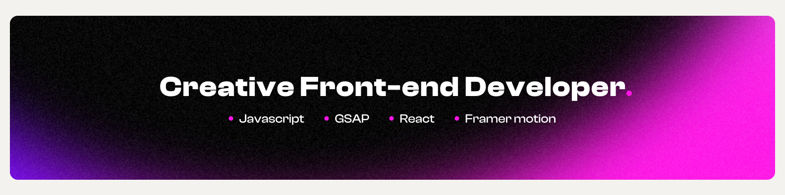

 

    

_._

    <h2 >
👋 Hello, I'm Dinil Thilakarathne
    </h2>

 

 

A creative Front-end developer with a passion for creative design and innovative solutions. I specialize in crafting visually stunning websites that not only look great but also deliver exceptional user experiences.
 

 

    

    <h2>Connect with me</h2>
    
Linkedin : [@dinil-thilakarathne](https://www.linkedin.com/in/dinil-thilakarathne/)

Instagram: [@sona_code](https://www.instagram.com/sona_code/)

Twitter: [@sone_code](https://twitter.com/sona_code/)

GitHub: [@dinil-thilakarathne](https://github.com/dinil-Thilakarathne/)

    

    
&nbsp;

